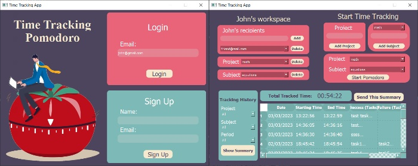
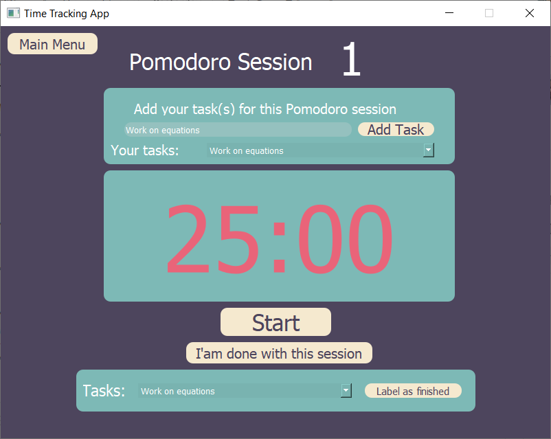
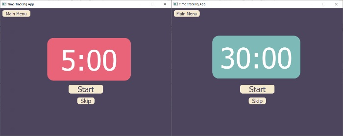
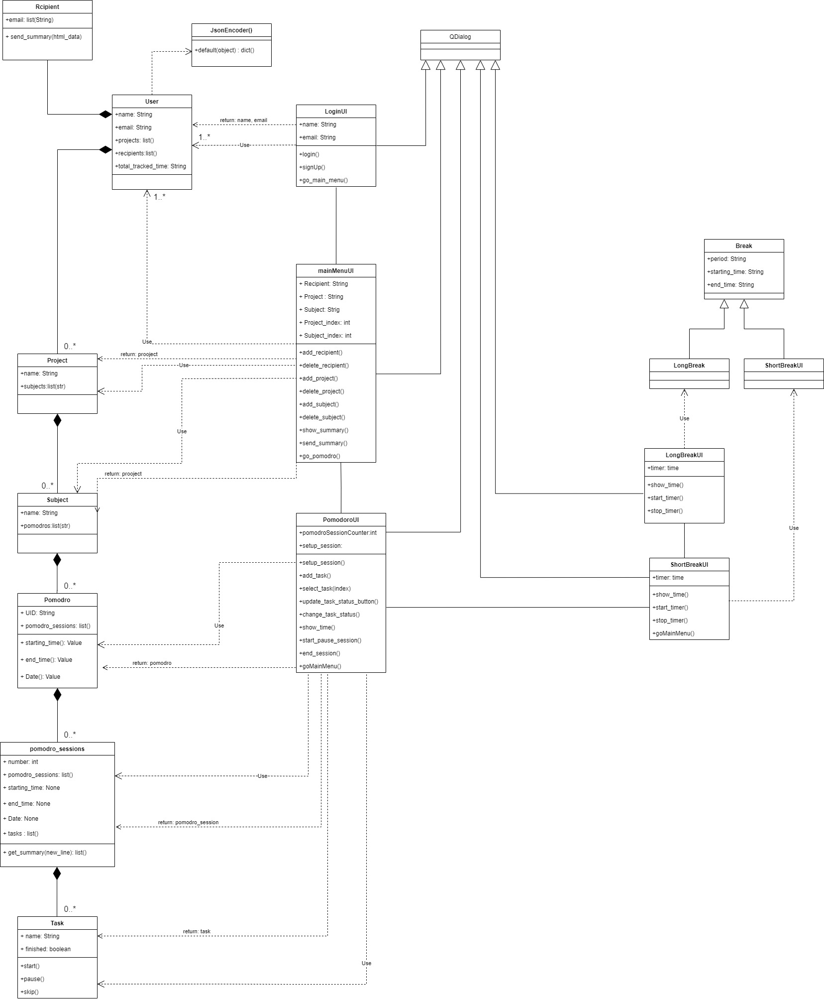
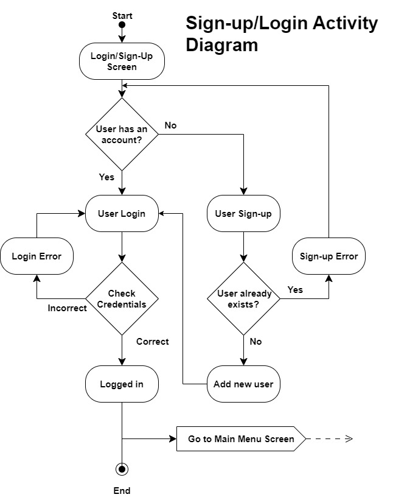
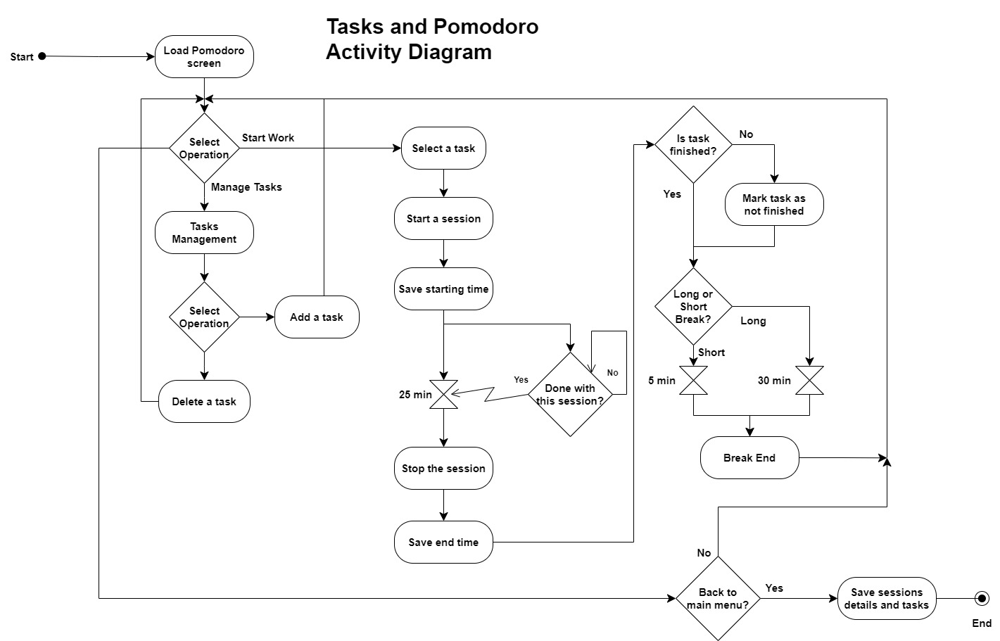
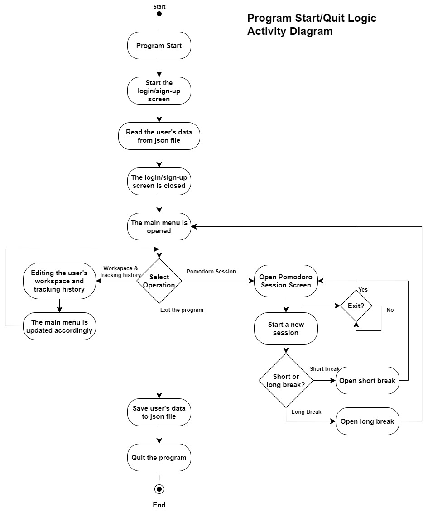
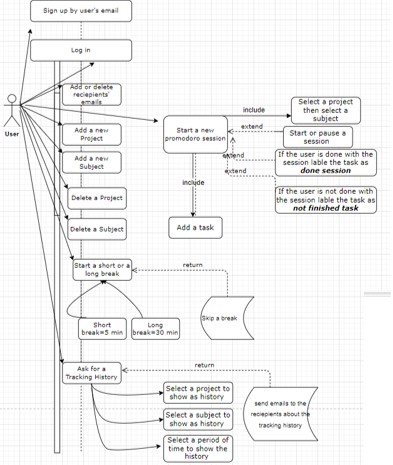

# Time Tracking Application

## Description

This project helps the user on managing their time and the tasks they want to accomplish. It gives the user an experience of interacting with UI to customize their subjects, projects, and tasks and give them a summary of their performance. The user can add recipients and send the summary of the Pomodoro sessions through email to recipients using their email addresses.

## Requirements 

 1. Python 3.6 or higher
 2. pip package installer
 3. smtplib library for sending emails
 4. PyQt5 5.15.7

 ## Installation

* To run the application directly, install the .exe file from the repository and run the application.

* To run the program from a python IDE:
1.  Clone or download the repository to your local machine.
2. Navigate to the project directory in your terminal/command prompt.
    
3. Install the required packages by running the 
following command:

        pip install -r requirements.txt

4. Run the main.py file by typing the following command in your terminal:

        python3 main.py
## Usage

###  Register and sign up page & main menu

* The user can register into the application using their email and username.
* Then the user can sign in to the application to enter to the main menu.
* In the main menu, the user can custom and adjust the session based on their needs in terms of recipients, projects or subjects.

### Pomodoro Session

* The session starts once the user clicks on starts pomodoro in the main menu, and it will direct them to the pomodoro session.

* In the pomodoro session, the user can add the tasks they need to accomplish and check when they are done.

### Short break & Long break

* After each session of pomodoro, the user can have a break for five minutes or they can skip the break if the user wants to. 
* After four sessions of pomodoro, the user can have a break for thirty minutes or they can skip the break also. 

## UML and activity diagrams

### class diagram
* The classes ued to complete this application are illustrated in the class diagram below.

### Signup/Sign in logic

* Sign in and sign up activity diagram.

### Tasks and Pomodoro sessions Logic

* Tasks (To-do-list) and Pomodoro sessions activity diagram.

###  Program Start/Quit Logic

* Start/Quit activity diagram.

### Usecase diagram

* This diagram shows how the user interacts with the application. 

## Collaborators/team members:

Project given by: [Fenyx IT Academy](https://github.com/fenyx-it-academy)

### Team members:

[Abdullah Al-Zaghir](https://github.com/abdullahalzaghir)

[Ziad Jradeh](https://github.com/ziad-jradeh)

[Girmay](https://github.com/gmaknl21)

[Kemal](https://github.com/Kemal919191)

[Muhammad Ziad](https://github.com/MuhammadZiad)

### Mentors:

[Muhammed Bahadir Kucuk](https://github.com/kucukbahadirh)

[Samet](https://github.com/s4mto)

## License 

This project is licensed under the MIT License.

