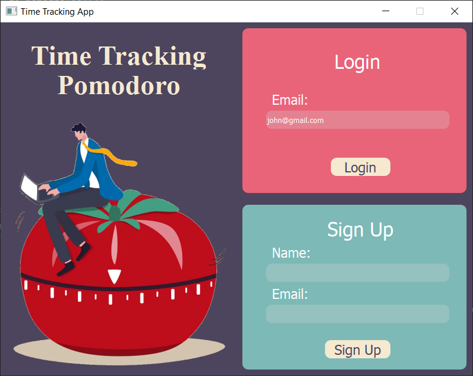
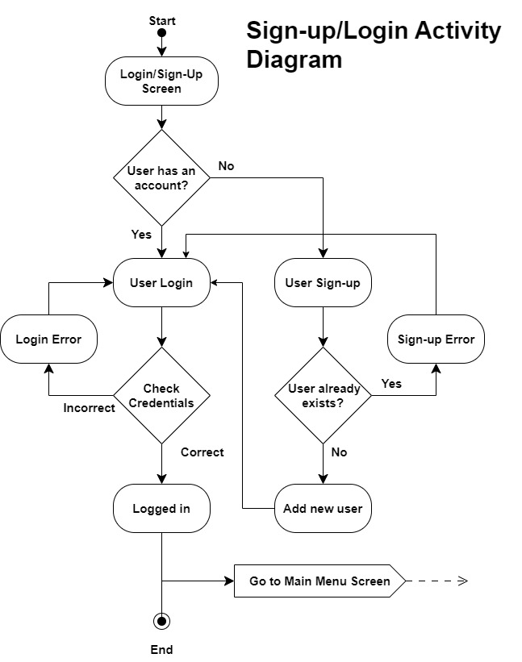

# Time Tracking Application
* This Project gives the user an experience on managing their time and the tasks they want to accomplish. 

## Login and sign up page

* The user can register into the application using their email and username.
* Then the user can sign in to the application to enter to the main menu.

## Main Menu

* In the main menu, the user can custom and adjust the session based on their needs in terms of recipients, projects or subjects. 

## Pomodoro Session

* The session starts once the user clicks on starts pomodoro in the main menu, and it will direct them to the pomodoro session.

* In the pomodoro session, the user can add the tasks they need to accomplish and check when they are done.

## Short break

* After each session of pomodoro, the user can have a break for five minutes or they can skip the break if the user wants to. 

## Long break

* After four sessions of pomodoro, the user can have a break for thirty minutes or they can skip the break also. 

# UML and activity diagrams

The UML class diagram for this application are shown below: 

## class diagram

## Signup/Sign in logic

* Sing in and sign up activity diagram.

## Tasks and Pomodoro sessions Logic

* Tasks (To-do-list) and Pomodoro sessions activity diagram.

##  Program Start/Quit Logic

* Start/Quit activity diagram.

